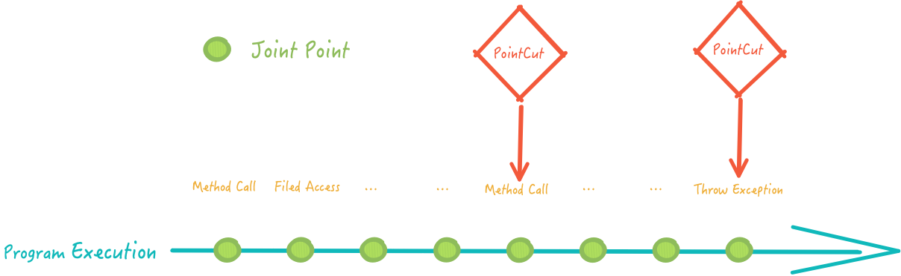
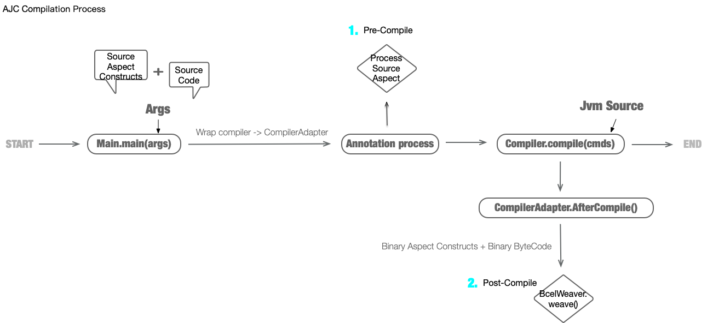

# Aspect-Android

&nbsp;&nbsp;&nbsp;&nbsp; 聊一下对 AOP 的理解，及 ApsectJ 介绍，如有问题敬请斧正。

## 理解 AOP
&nbsp;&nbsp;&nbsp;&nbsp;AOP 是个老生常谈的概念了。作为一种编程范式，AOP 的使用动机，多用于传统 OOP 程序设计无法很好的完成的场景。 如：动态权限处理、安全策略应用、Trace/Log 植入等。

&nbsp;&nbsp;&nbsp;&nbsp;这些场景的逻辑，大多以程序的最小单元进行批处理。OOP 中，这个最小单元是 Class 对象，我们常借助继承、代理等模式来完成统一处理。但如果被处理的 Class 对象彼此之间没有任何规律和关联，比如，目标是所有的 Class 对象，通过任何 OOP 的模式对所有 Class 对象进行批处理都听起来不太容易。

&nbsp;&nbsp;&nbsp;&nbsp;相同的问题以 AOP 的视角看，情况大有不同。

&nbsp;&nbsp;&nbsp;&nbsp;不妨先来谈一下 AOP 中 Aspect 的理解。 Aspect 字面意思为"方面"，私以为这里可以理解为视角，看待程序的视角，不同视角下，程序的存在形式也不同。在编写源码期间，程序是源文件；在编译期间，可以是任何编译中间产物（AST, SymbolTable, ByteCode, etc.) ； 在运行时，可以是 Runtime 对象。  在程序的不同生命周期，程序的形态不一样，我们对程序模块划分的方式也就不一样。

&nbsp;&nbsp;&nbsp;&nbsp;回到问题上，在 AOP 中，我们把视角切到编译期间，将每一个 “中间文件” 看作程序的最小模块单元，对这些单元进行批处理，插入自己的逻辑来完成需求。更具体些，只需 Hook 程序构建过程（多数构建工具支持自定义插件能力），找到目标文件，将符合"中间文件"语法的逻辑插入即可。 相比 OOP 对所有 Class 对象应用处理的 case，AOP 在编译期间以文件为操作对象，将逻辑集中一处，更符合程序设计。

&nbsp;&nbsp;&nbsp;&nbsp;所以我们表达程序逻辑不仅限于写源码，可以在编译前生成模板代码，可以在编译环节中修改中间代码，可以在运行时代理替换 Runtime 对象，每种方式各有使用场景。

## AsepctJ

### 简介
&nbsp;&nbsp;&nbsp;&nbsp; [ApsectJ](https://www.eclipse.org/aspectj/) 是 JVM 平台 AOP 的大名鼎鼎实现工具之一。其功能基本覆盖所有对 JVM 平台对 AOP 的使用需求，完全兼容 Java 语言，但不仅限于 Java 语言。托管于 Eclipse，发展至今已 10 余年，仍在随 Java 版本更迭。 

### 使用

#### 概念
&nbsp;&nbsp;&nbsp;&nbsp; 首先介绍 AspectJ 的几个概念，熟悉 Spring 的同学应该对这些概念不会感到陌生。

&nbsp;&nbsp;&nbsp;&nbsp;首先是最为基本的 

- Join Point : 程序流中连接点

&nbsp;&nbsp;&nbsp;&nbsp; 可以理解为 AspectJ 将 Java 程序执行 看作一系列 程序组成元素 的流，每个连接点是 AspectJ 可以插入逻辑的地方。这些连接点可以是一个方法调用前后，可以是异常抛出时，也可以是某个成员变量被修改时。所以 **Join Point** 可以理解为程序执行时某些特定的时机。

**其他 AspectJ 元素：**

| AspectJ Constructs | 释义 |常用与否 |
| -------- | -------- | -------- |
| PointCut     | 某个特定的 Join Point     | 是     |
| Advice     | 某特定 JoinPoint 来临的时机     | 是     |
| Inter-Type declearation     | 用于静态修改 Class 结构     | 否     |
| Aspects     | 以上所有元素的组合     | 否     |


&nbsp;&nbsp;&nbsp;&nbsp; 其中，*PointCut* 和 *JoinPoint* 的概念很容易混淆。Stackoveflow 有个 [比喻](https://stackoverflow.com/a/25779864/10247834) 很恰当，把 *JoinPoint* 比作餐厅菜单中所有的菜品，在用餐时，你可以有机会点任意菜品，但你显然不会把左右菜品都点一遍。当你下单后，你所选择的菜品即是 *PointCut*。 所以，*PointCut* 是 *JoinPoint* 的特定子集。
&nbsp;&nbsp; 我个人更喜欢把 *PointCut* 当作程序执行的 “横截面”来理解，将 AspectJ 理解为庖丁的解牛刀，程序即为牛整体，解剖的器官截面即为 *PointCut*。 因为在 *PointCut* 里可以获取程序变量在当时的值，好比能够一览整个截面一般。



<center><font color=gray>JoinPoint 与 PointCut 示意图</font></center>

&nbsp;&nbsp;&nbsp;&nbsp; *inter-type delarations* 比较少用，用于修改类结构，如，增加 Field，method，或者修改继承关系。

&nbsp;&nbsp;&nbsp;&nbsp; 就几种 AspectJ 结构体作用总结来说，*PointCut* 和 *Advice* 动态地影响程序执行，而 *inter-type declarations* 静态地修改 Class 结构，*Aspect*  则将几种修改程序的结构体封装，以便更好的复用和聚合切面逻辑。 *Aspect*  就像 OOP 中封装对象行为和属性的 Class 对象一样，将动态和静态影响程序行为的功能封装在内，对外使用。

#### API 使用
&nbsp;&nbsp;&nbsp;&nbsp; 关于 API 使用这里就简单提一下，详情移步 [官方 API 文档](https://www.eclipse.org/aspectj/doc/released/progguide/starting-aspectj.html#the-dynamic-join-point-model) 。

&nbsp;&nbsp;&nbsp;&nbsp; AspectJ 支持两套 API ，一套为使用 AJC (AspectJ Compile) 识别的语法，编写后缀为 .aj 的文件。
拿最常见的 Method call PointCut 为例 ：

- **AJC 语法**

###### **声明 PointCut**
```
call(void Point.setX(int))
```
&nbsp;&nbsp;&nbsp;&nbsp; 以上为一个 method call PointCut 的声明，call 关键字表示这是一个 method call 类型的 JoinPoint,  括号中的参数是一个 Java 方法签名，是寻找特定 method call JoinPoint 的匹配条件。

&nbsp;&nbsp;&nbsp;&nbsp; 当然也可以匹配多个方法，甚至可以为这系列的 method call joinpoints 命名

```
// 匹配多个 method 签名需逻辑运算符连接， 逻辑运算法含义与程序中一样
pointcut move():
    call(void FigureElement.setXY(int,int)) ||
    call(void Point.setX(int))              ||
    call(void Point.setY(int))              ||
    call(void Line.setP1(Point))            ||
    // 方法签名匹配同样支持通配符
    call(void Figure.make*(..))             ||
    call(void Line.setP2(Point));
```
###### **使用 PointCut**
&nbsp;&nbsp;&nbsp;&nbsp; 通过 Advice 来使用 PointCut

```
before(): move() {
    System.out.println("about to move");
}

after() returning: move() {
    System.out.println("just successfully moved");
}
```
&nbsp;&nbsp;&nbsp;&nbsp; 相信以上的代码含义是自解释的


- **注解语法**
```
   // 表示该类包含 aspect constructs;
   @Aspect
   public class Foo {
       
       // PointCut 声明
       @Pointcut("call(* java.util.List.*(..))") // must qualify
       void listOperation() {}

       @Pointcut("call(* java.util..*(..))")
       void anyUtilityCall() {}
			 
	   @After("execution(private * *(..))")
       void doBefore() {}
     }
```

&nbsp;&nbsp;&nbsp;&nbsp; 虽然这是个类声明，但可以理解为一张用 Java 语法来编写的信息表。 就声明 PointCut 用途来说，用 aj 语法和注解语法区别无他，但注解语法有两点好处：

1.  &nbsp;这是个彻头彻尾的 Java Pojo, 在没有 ajc 的情况下这个类也可以正常参与编译，方便我们将源代码编译和处理 AspectJ 元素过程分离。
2.  &nbsp;对于熟悉 Java 语法的程序员不会引入新的学习成本。

&nbsp;&nbsp;&nbsp;&nbsp;并且大多数对 AspectJ 的运用都是以注解的方式，基于这两点优势，后面我们对 AspectJ 的运用也会选择 AspectJ 的注解形式。

&nbsp;&nbsp;&nbsp;&nbsp;纵观 AspectJ API，其实就是在声明 PointCut，而寻找声明的 JoinPoint 并织入逻辑的功能由 AspectJ Compiler(AJC) 来完成。

### AspectJ 原理

&nbsp;&nbsp;&nbsp;&nbsp; AspectJ 详细的织入过程细节不在这里讨论，只是简单介绍一下，为后面自定义工具做铺垫。

&nbsp;&nbsp;&nbsp;&nbsp; 总览 AspectJ 使用，我们不难发现 AspectJ 和 Groovy 很像，有自身语法， 能够 100% 支持 Java 语法。同样，AspectJ 的魔法也发生在名为 “AJC” 的编译器上，在编译环节将我们声明的 Aspect construct 织入程序执行流程。

&nbsp;&nbsp;&nbsp;&nbsp; 跟 AJC 相关的逻辑体现在 [aspectjrt.jar](https://repo1.maven.org/maven2/org/aspectj/aspectjrt/1.9.7/aspectjrt-1.9.7.jar) 中，其中包含可以直接在命令行运行的 `org.aspectj.tools.ajc.Main.run()` 等系列 API，该 API 也是 ajc 命令的底层实现。Ajc 所做的事情大体分三个步骤：

1. 编译 .java 源文件，生成对应 class；
2. 对 Aspect constrcut 的字节码进行拓展，增加 “织入”过程所需的方法和属性；
3. 寻找 PointCut，进行织入；

&nbsp;&nbsp;&nbsp;&nbsp; 源文件编译由 `org.aspectj.org.eclipse.jdt.internal.compiler.Compiler` 来完成，同 javac 类似，其中包括对 classFile 进行注解处理，解析, 构建 AST，等系列编译操作，最终生成字节码。
&nbsp;&nbsp;&nbsp;&nbsp; 对 Aspect construts 的增强处理，可以有两处选择：1. 在 compile 之前处理源文件形式的 aspect constructs； 2. 在 compile 之后处理 class 形式的 aspect constructs。  其实处理过程无非是生成一些模板属性和方法。支持多种形式 aspect constructs 处理大大丰富了 AspectJ 的使用方式。
&nbsp;&nbsp;&nbsp;&nbsp;  最后的织入处理，AspectJ 采用 ClassVisitor 处理模式，操作字节码对 class 文件进行插桩。


#### CLI 编译简介
安装 ajc
```
brew install aspectj
```
&nbsp;&nbsp;&nbsp;&nbsp; AJC 的使用方式和 javac 命令很像，只是有部分参数不一样，详情移步[官方文档](https://www.eclipse.org/aspectj/doc/released/devguide/ajc-ref.html) 。这里我们选择常用参数了解下：


| Option |  参数含义 | 
| -------- | -------- | 
| -inpath     | 二进制输入，进行 post-compile 的 class 和 aspects     | 
| -classpath / -cp     | 同 Java classpath, 注意 aspectj cp 不会自动寻找依赖，需手动添加全部 cp     | 
| -sourceroots     | 源文件目录，如： src/main/java     | 
| -aspectpath     | aspect constructs 目录，一般同 sourceroots     |
| -d     | 输出目录     | 
| -outjar    | 以 jar 形式输出编译产物     | 

> 留意下 `-inpath` 这是 Ajc post-compile 的关键，后面我们会利用它。

比如 ：
| - me/yangxiaobin/demo/KtAspect.kt
| - me/yangxiaobin/demo/Main.kt

```
ajc -cp java/rt.jar:kotlinstd.jar:aspectjrt.jar  -sourceroots . -d outout/dist/ -1.8 . 
```

亦或者

```
// 编译源文件成 classes 到 dist
kotlinc . -d output/dist
// 只用 classes 做织入行为
ajc -cp jre/rt.jar:kotlinstd.jar:aspectjrt.jar -inpath output/dist -1.8 -d output/dist .
```

## AspectJ In Java / Android

&nbsp;&nbsp;&nbsp;&nbsp; 为了利用 AJC 的 Post-Compile 的优势，我们选择借助 AspectJ 的 [Compiler API ](https://www.eclipse.org/aspectj/doc/released/devguide/ajc-ref.html) ，其包含在 aspectj-tools 工件中，将编译后的 Classes 做织入处理。

以 Gradle Plugin 工具为例，伪逻辑如下
```
// 通常会是 KotlinCompile or JavaCompile 
val compiles = gradleTaskGraph.findInstance<AbstractCompile> 
compiles.foreach { c -> c.doLast ( doAjc ) }

fun doAjc () {
  val args = arrayof( "-1.8, -cp, jre/rt.jar:kotlinstd.jar:aspectjrt.jar, -sourceroot, src/main/java" ...)
  org.aspectj.tools.ajc.Main.main(args)
}
```

值得注意的点
1. 不同的 Compile Task 的 dist 目录不一样，需要把不同目录的 Classes 汇总作为输入
2. Android 平台可以借助 Transform 这个 Task，在 transform input 目录中获取所有 Classes 和 jars
3. 如果需要织入三方依赖，需要提供能够编译该 Jar 的完整 classpath，仅仅 compile classpath 可能不够

比如 ：项目依赖了 google 的 constraintlayout。 而 Project source code 的 compile classpath 中仅包含 constraintlayout-api.jar。 但如果想对 constraintlayout 进行织入，需要能够编译 constraintlayout 整个工件的 classpath。显然只有 api.jar 是不够的，还需要在 runtimeclasspath 中找到 runtime.jar。


## 用途

- Log
- Trace
- 自动化工具，如：自动页面 pv， 自动控件点击

&nbsp;&nbsp;&nbsp;&nbsp; 经常做性能优化和自动工具同学应该对项目 AOP 的能力比较依赖。相比其他流行 AOP 工具，如 ASM、Javasist，AspectJ 学习成本最低，又能以编辑源码的方式来完成切面代码，Ajc post-compile 又支持所有 JVM 语言，综上，AspectJ 为 AOP 工具不二之选。

- Demo 见[androidapp](../androidapp)


## 参考
- [ApectJ Eclipse Home Page](https://www.eclipse.org/aspectj/)

- [AspectJ Github](https://github.com/eclipse/org.aspectj)

- [What's the difference between JoinPoint and PointCut?](https://stackoverflow.com/a/25779864/10247834)
